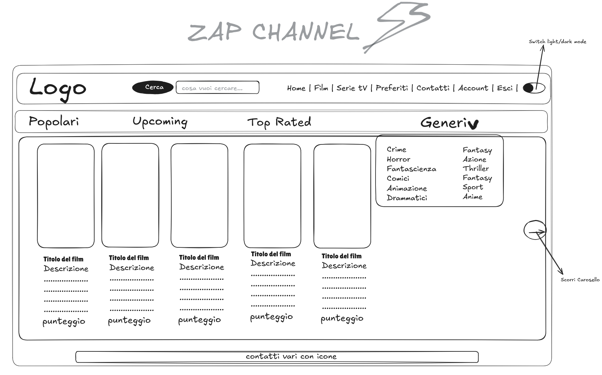

# React + Vite

This template provides a minimal setup to get React working in Vite with HMR and some ESLint rules.

Currently, two official plugins are available:

-   Logo del nostro sito fisso su tutte le schede (cliccandolo si accederà alla Home)

-   Una barra di ricerca per trovare i contenuti desiderati (inserendo valori in un input box e cliccando su un button)

-   Home
-   Categorie Film
-   Categorie Serie Tv
-   Preferiti (si accederà ad una scheda con i nostri contenuti salvati)
-   Contatti (si accederà ai contatti quali email e pagine social)
-   Account (cliccando sulla scheda account si accederà alle informazioni dell'utente)
-   Esci (si accederà adlla pagina di login con un link per eventualmente effettuare la registrazione)

*   cliccando su film o Serie tv sulla navbar principale si manifesterà una seconda navbar con Generi, Popolari, Top Rated , Upcoming

*   cliccando su generi si apre un menù a tendina con i vari generi selezionabili che poi ci mostreranno della sezione dedicata solo i contenuti relativi al genere scelto

# una sezione dedicata alle card dei film/serie tv che si apre in base alla catgoria scelta (di default Popolari)

# un footer con i vari contatti (link fatti a icone cliccabili per accedervi)

